<div align="center">

# 🎯 CsDemoAnalyzer

**本地优先的 CS2 Demo 分析平台** —— 解析 `.dem`，产出定量统计 + 电竞 OB 级实时 2D 回放

[](https://www.python.org/)
[](#)
[](#license)
[](#)
[](https://echarts.apache.org/)

**实时回放 · 控图染色 · 枪法纪律 · 经济博弈 · 下包攻防 · 大数据对比**

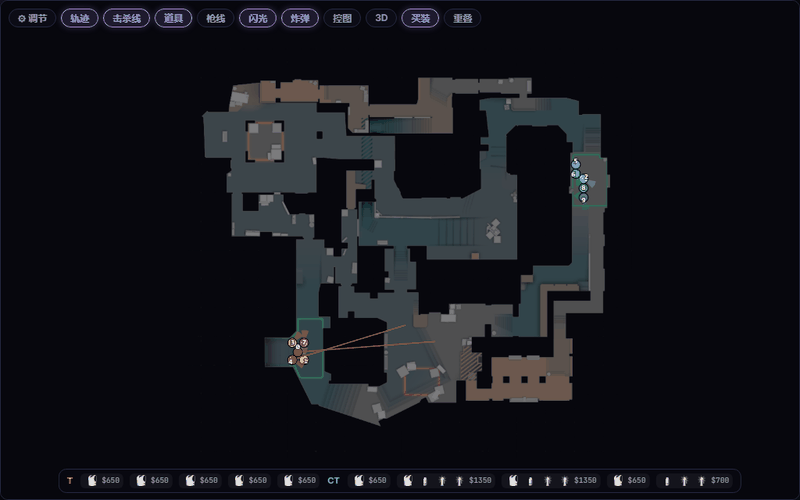

*实时回放器：OB 视角 + 轨迹 + 道具/击杀覆盖层 + 买装条（回合 13 实录）*

</div>

---

## 这是什么

把 CS2 比赛录像（`.dem`）变成**可交互的分析平台**：

- **定量视角** —— 评分雷达、对枪矩阵、经济博弈、部位伤害、枪法纪律、下包攻防、武器拆分
- **空间-时间视角** —— 电竞转播级 2D 实时回放：相机缩放平移、道具弧线、枪线曳光、控图染色、伪 3D 视图
- **大数据对比** —— 个体 vs 全库基线（≥5 场样本）的分位对比，不是两两 PK
- 全部本地运行，**不需要任何在线服务**；浏览器打开 `http://127.0.0.1:8000` 即用

## 界面一览

### 📺 实时回放器
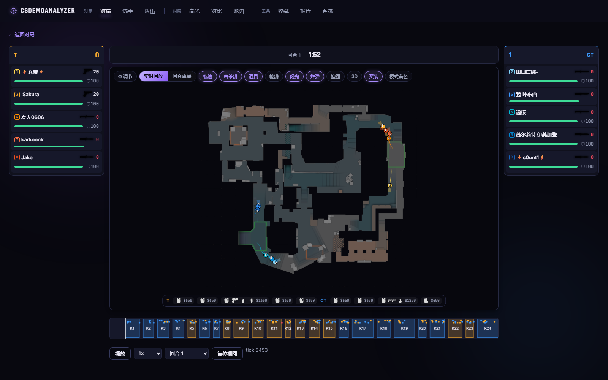

电竞 OB 布局：中央 2D 地图 + 两侧选手面板（武器图标/弹药/血甲/换弹徽标），比分板 + 回合时钟 + 炸弹倒计时。
相机缩放至光标/拖拽平移；道具飞行弧、烟/火真实时长区域、枪线曳光、闪光环、下包/拆弹/爆炸标记；
**控图染色**（高斯影响核 + EMA 平滑）与**伪 3D 挤出视图**一键切换；缩放 LOD 逐级浮现血量环/弹药/武器徽章。
点击任一选手**镜头跟随聚焦**（2.5× 持续跟踪），其余选手自动变暗。

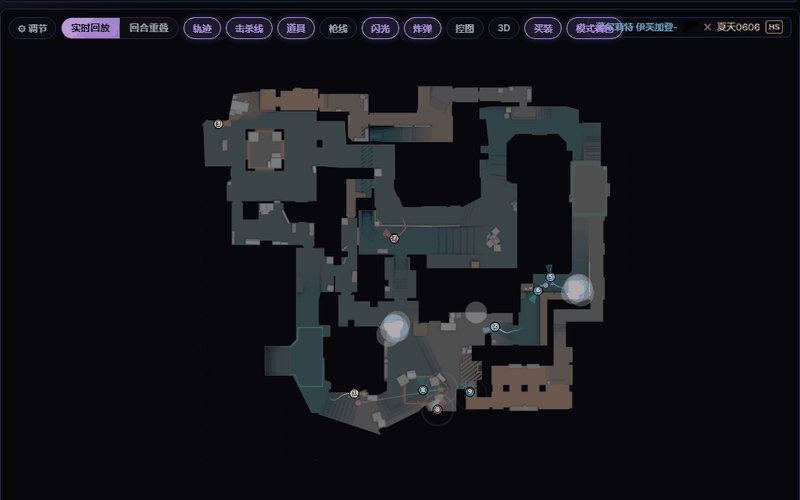

*点击选手即镜头 2.5× 平滑跟随，其余选手自动变暗（回合 13 实录）*

### 🧩 回合重叠（回放器子模式）
工具条 `[ 实时回放 | 回合重叠 ]` 一键切换：同半场全部回合按相同相对时刻叠加，暖色 = T 方 / 冷色 = CT 方，
编号跨回合锚定选手身份——开局路线、默认站位、重复决策一目了然。回合网格按胜方角标勾选对比
（空选 = 全部，快捷「前4」），阵型曲线（全体散开度 / T-CT 重心间距）与相位滑杆联动，
「模式着色」对开局路线做 k-means 聚类染色，聚焦选手可见各回合相对队伍重心的偏差连线与读数。

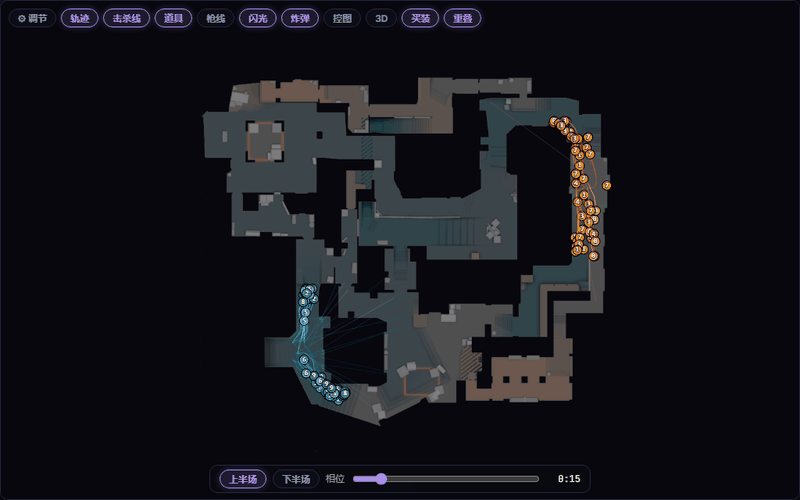

*重叠子模式：上半场 12 个回合同相位扫动，烟雾/交战逐相位对齐出现*

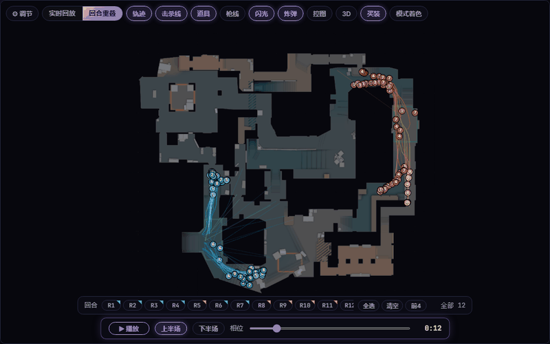

*重叠交互实录：回合网格「前4」过滤 → 「模式着色」聚类染色 → 点击聚焦，
紫色虚线为各回合同相位相对队伍重心的偏差连线（读数 u/米），镜头 2.5× 跟随*

### 📊 对局详情 · 六 Tab
| 概览 | 击杀 |
| :---: | :---: |
| 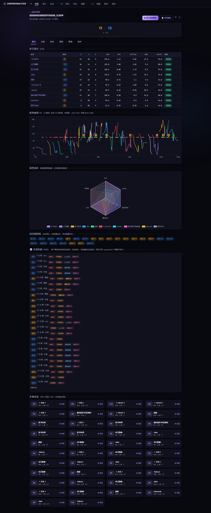 | 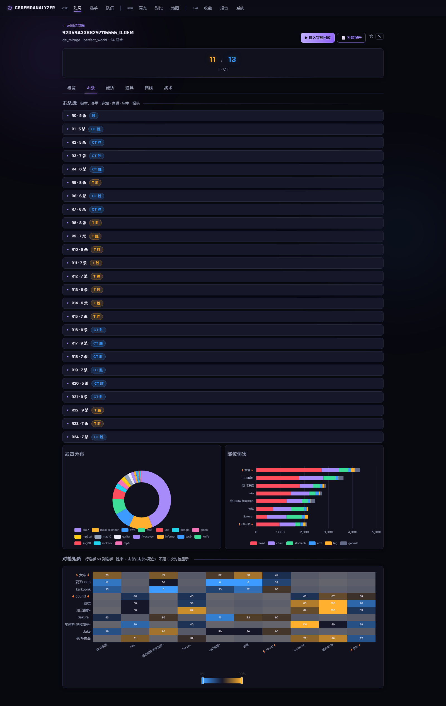 |
| **经济** | **路线 + 下包攻防** |
| 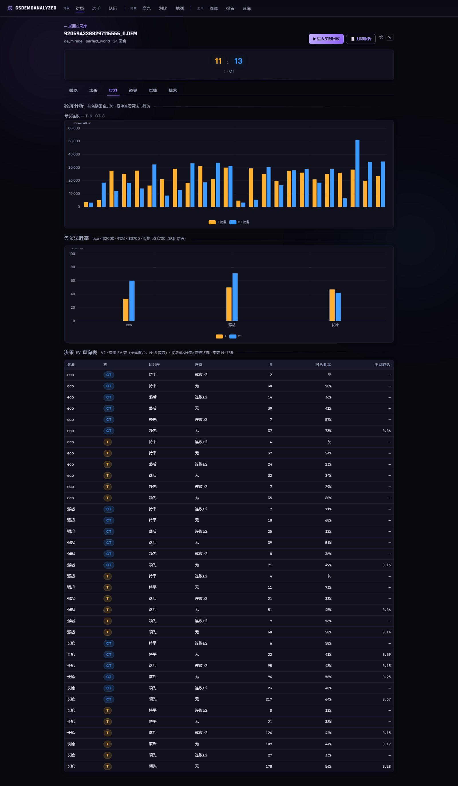 | 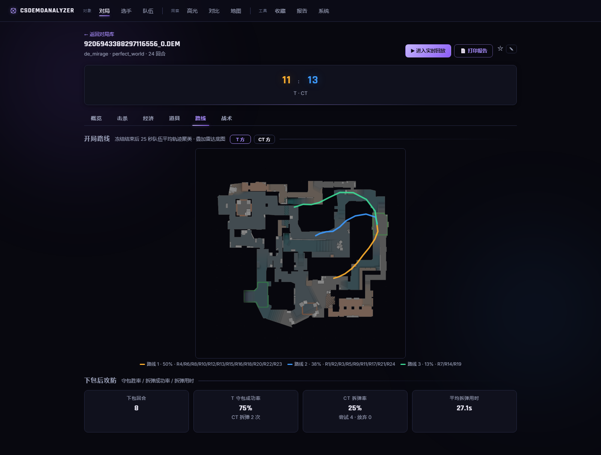 |

- **击杀**：逐杀情境徽章（穿墙/穿烟/盲狙/空中/爆头）+ 武器分布环图 + 部位伤害堆叠条 + 对枪矩阵
- **经济**：每回合消费按买法（eco/强起/长枪）标注、各买法胜率、连败追踪
- **路线**：开局轨迹 k-means 聚类（T/CT 双方），下包后攻防四卡（守包率/拆弹率/尝试/用时）
- **战术**：开火→击杀转化率、移动/开镜/蹲下开火占比、首发延迟、武器类别拆分

### 📈 跨场生涯与大数据对比
| 生涯页 | 对比页 |
| :---: | :---: |
| 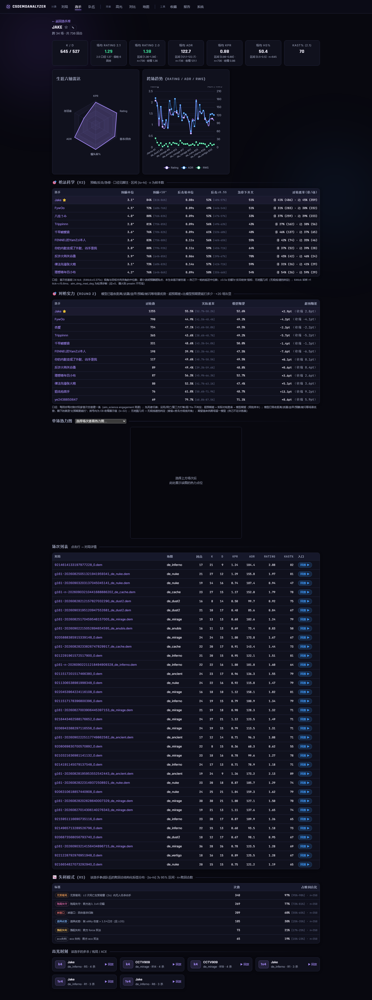 | 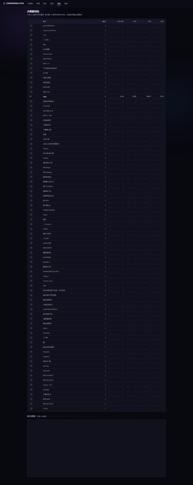 |

生涯页聚合每位选手的全部场次（雷达/趋势/单场热力图/个人高光）；对比页基于 ≥5 场有效样本计算
全库**百分位分位**，可勾选多名选手雷达叠加。**五排协同**卡：跨场助攻/补枪/闪光助攻连接网络
（矩阵热力 + Top 连线）、车队局 vs 混野的胜率/Rating/首杀对比、常客画像标签（闪光发动机/首杀先锋/残局大师）。

## 快速开始

```bash
# Python 3.11+（无需 ffmpeg —— 没有任何服务端渲染）
pip install -e .
```

**最省事**：双击仓库根目录 **`start_web.bat`** —— 自动起服务并打开浏览器。

| 命令 | 说明 |
| :--- | :--- |
| `start_web.bat` | 启动服务 + 开浏览器（已在运行则只开浏览器） |
| `start_web.bat restart` | **改了代码后用这个**：结束旧进程并加载新代码 |
| `stop_web.bat` | 一键关闭服务 |

或手动：

```bash
csa serve                          # 本地平台 → http://127.0.0.1:8000
csa info path/to/demo.dem          # 看 demo 元信息
csa parse path/to/demo.dem         # 解析并缓存
csa analyze path/to/demo.dem       # 终端输出统计表
csa coverage "demos/*.dem" --out report.html   # 解析覆盖度报告
```

然后把 `.dem` 拖进网页上传（支持多文件、内容哈希去重），或直接放入 `demos/` 目录。

## 功能全景

**解析层**
- demoparser2（Rust）+ Provider 自动识别（Valve MM / Faceit / Perfect World / 5E）
- 内容寻址缓存（JSON + Parquet），重复分析 <1s
- SourceTV 容错：无 `player_info` 时从 spawn 重建名单；阵营以逐 tick `team_num` 多数派为真值（换边安全）
- 经验 tick rate 推导（velocity ÷ 位移中位数），match_id 自动提取

**定量分析（13 个可插拔模块）**
- 基础：K/D/A、KPR、ADR、HS%、首杀/首死率
- 评分：RWS、HLTV Rating 2.0 近似、KAST（标准 trade 语义）、Impact
- 进阶：对枪矩阵、经济买法分类与胜率、闪光价值 + 闪光助攻、烟中击杀、开局路线聚类（T/CT）、
  多杀/残局高光库、击杀情境徽章、部位伤害 + 护甲效率、枪法纪律、下包攻防、武器拆分

**实时回放器**
- viewer-data 快照包（8Hz，gzip ~0.7MB）首次打开 <3s 构建
- 逐 tick 弹药/换弹（demoparser2 0.42）、枪口焰 + 曳光、缩放 LOD
- 控图实时染色 + 伪 3D（帧预算 p95 0.2ms）
- **⚙ 视觉参数调节面板**：19 个渲染参数滑杆实时可调，保存后可固化为新默认
- 买装条：回合前 20 秒显示双方购枪配置

## 界面语言与兼容性

全中文界面。已端到端验证：**Valve SourceTV** 测试 demo 与 **完美世界 (WMPVP)** SourceTV 真实对局
（后者无 `player_info` 表、事件列表缺项——引擎已自动容错）。

已知限制：个别 SourceTV 广播中某些玩家的 pawn 实体无法解析（Team 0）——位置类分析跳过该玩家，
统计与击杀数据仍完整；`bomb_exploded` 事件部分广播缺失（客户端已按回合边界容错）。

## 架构

```
.dem file
    │
    ▼
[Parser] ── demoparser2 + Provider ──> ParsedDemo (DemoData + DataFrames)
    │                                    │
    │                                    ▼
    │                          .cache/{hash}/ (JSON + Parquet)
    ▼
[Analysis] ── 可插拔模块（拓扑排序 + 惰性 memo）──> typed AnalysisResult
    │
    ▼
[Web] ── FastAPI + Jinja2 SSR ──> 浏览器渲染
    ├── viewer-data v4 JSON  ──> canvas 回放器（相机/覆盖层/控图/买装条）
    └── charts.json 载荷     ──> vendored Apache ECharts（全离线暗色主题）
```

完整设计文档见 [ARCHITECTURE.md](ARCHITECTURE.md)，阶段历史见 [HANDOFF.md](HANDOFF.md) 与 [dev_log.md](dev_log.md)。

### 分析模块

| 模块 | 输出 |
| :--- | :--- |
| `basic_stats` | K/D/A、KPR、ADR、HS%、FKPR/FDPR |
| `ratings` | RWS、Rating 2.0、KAST、Impact |
| `preference` | 位置热力、道具落点、接敌风格、准星高度 |
| `duels` | 选手 × 选手对枪胜率矩阵 |
| `economy` | 逐回合 eco/force/full 分类 + 各买法胜率 + 连败 |
| `utility_effect` | 闪光价值榜、闪光助攻、烟中击杀/死亡 |
| `routes` | 开局路线聚类（种子化 k-means，T/CT 双方） |
| `highlights` | 多杀 2K-ACE、残局 1vN、ACE 高光库 |
| `kill_context` | 穿墙/穿烟/盲狙/空中/距离徽章、MVP、捡枪 |
| `hitgroups` | 部位伤害分布、护甲减伤效率 |
| `aim` | 开火转化、移动状态开火、首发延迟 |
| `postplant` | 守包/retake 胜率、拆弹尝试与用时 |
| `weapon_splits` | 武器类别击杀/死亡拆分 |

## 缓存

按内容哈希缓存于 `.cache/{demo_hash}/`（`model.json` + `ticks.parquet` + `events/*.parquet`），
同一 demo 重复分析 <1s；解析器版本升级自动失效重解析。

## RWS / Rating 说明

RWS 与 Rating 为自实现的专有公式近似（HLTV 2.0 / ESEA RWS 风格），与外部平台数值接近但不完全一致。

## 开发

```bash
pip install -e ".[dev]"
pytest                    # 189 tests
ruff check cs_analyzer/
```

## License

MIT
